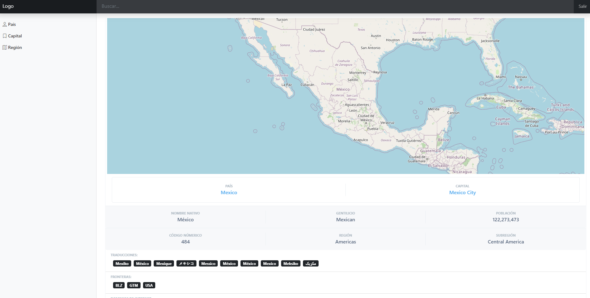

# app-practices-paises
> En esta aplicación se muestran los fundamentos de una aplicación SPA (Single Page Application). 



## Tabla de contenidos

---

- [Demo 🖥️](#demo-🖥️)
- [Comenzando 🚀](#comenzando-🚀)
    - [Pre-requisitos 📋](#pre-requisitos-📋)
    - [Instalación 🔧](#instalación-🔧)
- [Despliegue 📦](#despliegue-📦)
- [Construido con 🛠️](#construido-con-🛠️)
    - [Temas abordados 📚](#temas-abordados-📚)
- [Versionado 📌](#versionado-📌)
- [Autores ✒️](#autores-✒️)
- [Licencia 📄](#licencia-📄)

## Demo 🖥️

---

[Ver demo](https://stackblitz.com/github/magranadosb/app-practices-paises)

## Comenzando 🚀

---

_Estas instrucciones te permitirán obtener una copia del proyecto en funcionamiento en tu máquina local para propósitos de desarrollo y pruebas._

### Pre-requisitos 📋
* [Angular CLI](https://angular.io/cli)
* [NodeJS](https://nodejs.org/en/)
* [GIT](https://git-scm.com)

### Instalación 🔧

```
$git clone https://github.com/magranadosb/app-practices-paises.git
```

_Después de clonar el proyecto, ingresa a la carpeta creada app-practices-paises._

```
$npm install
```
## Despliegue 📦

```
$ng serve -o
```

## Construido con 🛠️

---

* [Angular CLI v12](https://angular.io/) - Este proyecto se generó con la versión 11.0.5 de Angular CLI.
* [Bootstrap v5.0](https://getbootstrap.com/docs/5.0/getting-started/introduction/)

### Temas abordados 📚

* Consumo de APIs
* Componentes especializados
* DebounceTime
* Inputs
* Rutas
* RouterLink
* RouterLinkActive
* SwitchMap
* Tipado de datos
* [OpenLayers](https://openlayers.org/) - Facilita la colocación de un mapa dinámico en cualquier página web.

## Versionado 📌

---

Se usa [SemVer](http://semver.org/) para el versionado. Para todas las versiones disponibles, mira los [tags en este repositorio](https://github.com/magranadosb/app-practices-paises/tags).

## Autores ✒️

---

* **Marco Antonio Granados** - *Trabajo Inicial* - [magranadosb](https://github.com/magranadosb)

También puedes mirar la lista de todos los [contribuyentes](https://github.com/magranadosb/app-practices-paises/graphs/contributors) quíenes han participado en este proyecto. 

## Licencia 📄

---

Este proyecto está bajo la Licencia MIT - mira el archivo [LICENSE.md](LICENSE.md) para más detalles.